# BAR (Backup and Restore) Tools

## AI Agent Integration with DSA Architecture

```mermaid
flowchart TD
    %% AI Agent Layer
    User[👤 User] --> LLM[🤖 AI Agent] --> Output[📄 Output]
    
    %% MCP Integration
    LLM --> MCP[🔌 MCP Server]
    MCP --> API[🌐 DSA API]
    API --> DSC[🎛️ DSC]
    
    %% DSA Infrastructure
    DSC --> DSMain[📊 DSMain]
    DSC --> BarNC[📦 BarNC]
    
    %% Data Flow
    DB[(🗄️ Database)] <--> DSMain
    DSMain <--> BarNC
    BarNC --> Storage{💾 Storage}
    
    %% Storage Options
    Storage --> Disk[📁 Disk]
    Storage --> Cloud[☁️ Cloud]
    Storage --> Enterprise[🔒 Enterprise]
    
    %% Styling
    classDef primary fill:#e3f2fd,stroke:#1976d2
    classDef secondary fill:#f3e5f5,stroke:#7b1fa2
    classDef storage fill:#e8f5e8,stroke:#388e3c
    
    class User,LLM,Output primary
    class MCP,API,DSC secondary
    class DSMain,BarNC,DB,Storage,Disk,Cloud,Enterprise storage
```



## Prerequisites

**DSA Infrastructure** must be properly configured and running before using BAR tools

### Environment Variables
The BAR tools require the following environment variables for DSA connection:

- `DSA_BASE_URL` - Base URL for DSA API (default: https://localhost:9090/)
- `DSA_USERNAME` - Username for DSA authentication (default: admin)
- `DSA_PASSWORD` - Password for DSA authentication (default: admin)
- `DSA_VERIFY_SSL` - Whether to verify SSL certificates (default: true)
- `DSA_CONNECTION_TIMEOUT` - Request timeout in seconds (default: 30)

### BAR Profile Configuration
The BAR profile is defined in `config/profiles.yml` and controls access to BAR-related tools and resources.

**Profile Configuration:**
```yaml
bar:
  tool:
    - ^bar_*          # All BAR tools (bar_manageDsaDiskFileSystem, etc.)
    - ^base_readQuery$  # Read-only database queries
    - ^base_databaseList$  # Database listing
  prompt:
    - ^bar_*          # BAR-specific prompts
  resource:
    - ^bar_*          # BAR-specific resources
```

**What the BAR profile enables:**
- Access to all `bar_*` tools for backup and restore operations
- Basic database read operations for backup source identification
- Database listing capabilities for backup planning
- BAR-specific prompts and resources

**Usage:** Specify `--profile bar` when running MCP server to enable BAR-specific functionality.


## Available Tools

**Total Estimated Tools: 16** (5 ✅ Developed, 11 🚧 Planned)

### Storage Configuration Tools

#### bar_manageDsaDiskFileSystem ✅
**Status**: Developed
Unified tool for managing DSA disk file system configurations for backup storage.

#### bar_manageAwsS3 🚧 
**Status**: Work-In-Progress
Tool for managing AWS S3 bucket configurations for backup storage.

#### bar_manageAzureBlob 🚧
**Status**: Planned
Tool for managing Azure Blob Storage configurations for backup storage.

#### bar_manageGoogleCloud 🚧
**Status**: Planned
Tool for managing Google Cloud Storage configurations for backup storage.

#### bar_manageNetBackup 🚧
**Status**: Planned
Tool for managing NetBackup configurations for enterprise backup storage.

#### bar_manageIbmSpectrum 🚧
**Status**: Planned
Tool for managing IBM Spectrum Protect configurations for backup storage.

### Infrastructure Management Tools

#### bar_manageMediaServer ✅
**Status**: Implemented
Tool for managing media server configurations including list, get, add, delete, and consumer management operations.

#### bar_manageTeradataSystem ✅
**Status**: Implemented
Tool for managing Teradata system configurations and consumers in DSA. Supports listing systems, getting system details, configuring new systems, enabling/deleting systems, and managing system consumers.

### Target Group Management Tools

#### bar_manageDiskFileTargetGroup ✅
**Status**: Implemented
Tool for managing disk file target group configurations with comprehensive management of backup target groups including create, list, get, enable, disable, and delete operations.

#### bar_manageAwsS3TargetGroup 🚧
**Status**: Planned
Tool for managing media server configurations with AWS S3 storage solutions.

#### bar_manageAzureBlobTargetGroup 🚧
**Status**: Planned
Tool for managing media server configurations with Azure Blob storage solutions.

#### bar_manageGoogleCloudTargetGroup 🚧
**Status**: Planned
Tool for managing media server configurations with Google Cloud storage solutions.

#### bar_manageNetBackupTargetGroup 🚧
**Status**: Planned
Tool for managing media server configurations with NetBackup storage solutions.

#### bar_manageIbmSpectrumTargetGroup 🚧
**Status**: Planned
Tool for managing media server configurations with IBM Spectrum storage solutions.

### Operations Management Tools

#### bar_manageJob ✅
**Status**: Implemented
Comprehensive tool for managing backup and restore job lifecycle including creation, updates, retrieval, retirement, deletion, execution, and status monitoring. Supports all DSA job operations through REST API endpoints.

#### bar_manageSaveSets 🚧
**Status**: Planned
Tool for managing backup files/objects (save sets) created by backup operations.

---

[← Return to Main README](../../../../README.md)
